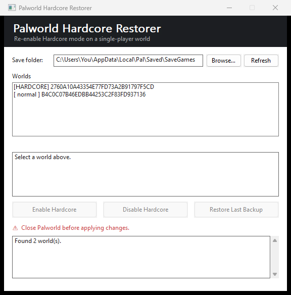

# Palworld Hardcore Restorer

**Re-enable Hardcore mode on a Palworld single-player world after the in-game toggle has locked itself.**

You started a Hardcore world, died once, turned Hardcore **off** to revive your
character — and now Palworld greys out the Hardcore toggle and won't let you turn
it back **on**. This tiny tool flips it back on directly in the save file.

A single self-contained `.exe` — **no Python, no installer, no runtime, no
dependencies**. Just download and run.



---

## Features

- ✅ **One click** to re-enable (or disable) Hardcore on any local world.
- ✅ **Automatic timestamped backup** before every change.
- ✅ **Restore** button to undo the last change.
- ✅ Auto-detects your worlds and shows each one's hardcore status.
- ✅ Handles the modern **`PlM1` / Oodle**-compressed save format.
- ✅ **Single 450 KB exe**, depends only on core Windows DLLs.
- ✅ Warns you if Palworld is still running.

---

## Download & use

1. Get `PalworldHardcoreRestorer.exe` (from **Releases**, or build it — see below).
2. **Close Palworld.**
3. Run the exe, pick your world (it shows `[HARDCORE]` / `[ normal ]`).
4. Click **Enable Hardcore**. A backup is saved automatically first.
5. Launch Palworld and load the world.

Saves are found automatically under `%LOCALAPPDATA%\Pal\Saved\SaveGames`. Use
**Browse…** to point somewhere else (e.g. a single world folder). **Restore Last
Backup** undoes the last change.

### Good to know

- **The in-game Hardcore toggle stays greyed-out** — that's just the menu lock.
  The world *is* hardcore again; permadeath applies on your next death.
- **Difficulty may read "Custom."** Palworld turns a preset into "Custom" the
  moment any setting changes; hardcore behavior runs off the `bHardcore` flag,
  not the difficulty label.
- **Backups** are written to a `backups\` folder next to the exe, before every
  change. Keeping your own copy of the world folder never hurts.
- **Single-player / local co-op host saves** only. Dedicated servers set Hardcore
  in `PalWorldSettings.ini` instead.
- Some antivirus tools flag unknown small exes on sight — the full source is here;
  rebuild it yourself with `build.bat` if in doubt.

---

## How it works

Modern Palworld saves are `PlM1` containers = **Oodle-compressed GVAS**. The tool:

1. Decompresses `WorldOption.sav` with the vendored **ooz** Oodle decoder.
2. Flips the single `bHardcore` value byte in the GVAS — a fixed-size edit; no
   bytes shift and nothing else is touched.
3. Re-saves as `PlZ` (zlib, via **miniz**) — a container every Palworld version
   reads. The game rewrites it back to `PlM` on its next save.

The edit was verified byte-for-byte against the reference Python implementation
(`palworld-save-tools`): identical output, only the one intended byte changes.

---

## Build from source

Needs **Visual Studio 2022/2026** with the *Desktop development with C++* workload.

```bat
build.bat
```

Run it from a *x64 Native Tools Command Prompt for VS*, or just double-click it —
it tries to locate the VS build environment on its own. Output lands at
`dist\PalworldHardcoreRestorer.exe`. Everything links statically (`/MT`), so the
result needs only core Windows DLLs.

```
src/main.cpp       Win32 GUI
src/palsave.*      decode / edit / encode + backups
src/ooz/           vendored Oodle decoder (C++)
src/miniz.*        vendored zlib (MIT)
```

---

## License & credits

This project's own code is **MIT** licensed — see [`LICENSE`](LICENSE).

Bundled third-party components have their own terms — see [`NOTICE.md`](NOTICE.md):

- **[ooz](https://github.com/powzix/ooz)** — a clean-room, reverse-engineered
  decompressor for Oodle (a proprietary codec by Epic/RAD). Redistributing a
  reverse-engineered implementation of a proprietary codec is a legal grey area.
  **Read `NOTICE.md` before redistributing.** It also documents a no-`ooz`
  alternative (users supply their own official `oo2core` DLL).
- **[miniz](https://github.com/richgel999/miniz)** — MIT, see `MINIZ_LICENSE.txt`.
- Verified against **[palworld-save-tools](https://github.com/cheahjs/palworld-save-tools)** (MIT).

Not affiliated with Pocketpair (Palworld), Epic Games, or RAD Game Tools.
"Palworld" and "Oodle" are trademarks of their respective owners. Use on your own
save files, at your own risk.
